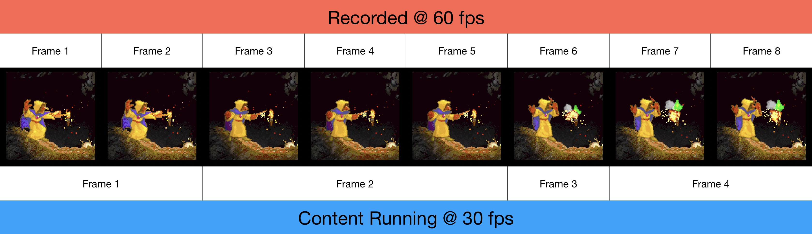
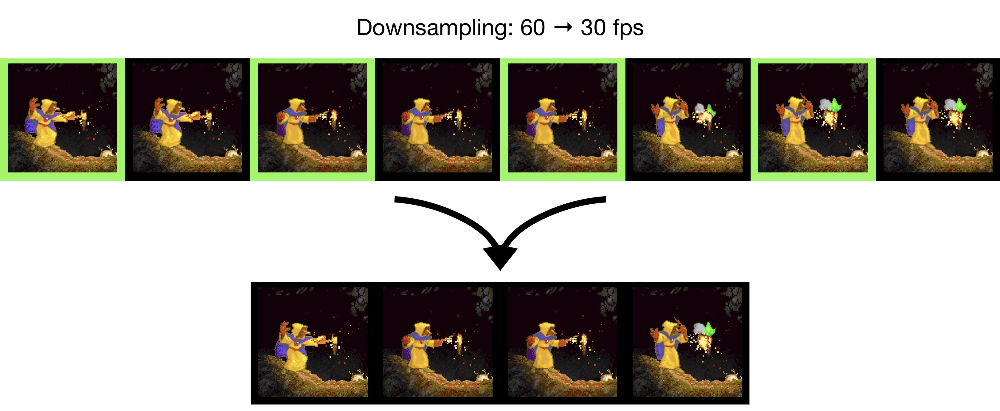
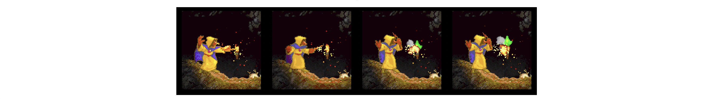

#FrameFixer

---

*Prepare high fps recordings for downsampling by ensuring that fewer or less important frames are dropped*

## The Problem

If you have a 60 fps recording that needs downsampling to 30 fps, some frames will be dropped, but depending on the content, you may be able to minimize what frames are lost.  Recently, I was using Apple's built-in Quicktime Screen Recorder to record my playing an old computer game in a classic Mac emulator called SheepShaver.  The game, Ferazel's Wand, actually runs at about 30 frames per second, but Quicktime records at 60 frames per second.  This means it should be possible to downsample without losing any frames.

But, if the game's refresh rate isn't perfectly aligned with the recording's capture rate, a potential for lost frames arises.



The image above shows 8 frames as recorded at 60 fps.  Since the game plays at 30 fps, this should be 4 frames of the final, downsampled video.  However, notice that the actual Frame 3 in the game did not get refreshed in time to be captured in Frame 5 of the recording.  The game's Frame 3 appears only once in Frame 6 of the recording.

When downsampling from 60 fps to 30 fps, the system will simply choose every other frame.  The next image shows these frames highlighted in green.  Notice that the final result is indeed 4 frames, but it is missing Frame 3 from the game.



Frame 3 has been dropped, even though there's a slot for it in the final video!  This is especially problematic because Frame 2 is now unnecessarily repeated.

## The Solution

There's a couple ways to solve this problem.

One is to stick with 60 fps video.  This will prevent dropped frames in the data, but most viewers will default to a 30 fps display, so you may still lose them during viewing.  Plus, if the original content was at 30 fps, like the game in my case, you are wasting either storage space or processing/decoding time handling duplicate frames (depending on the codec).

Another solution is to downsample to 30 fps and forget about it!  It's true that a few dropped frames here or there won't be that noticeable.  If you're willing to lose the original data and deal with slightly choppy video, it's certainly the easiest approach.

To me, neither of those are good options.  I will not destroy original data if I can at all avoid it, and I think it's a waste of time and space to store a full 60 fps recording of a 30 fps game.  This is where *FrameFixer* comes in.

*FrameFixer* reads a video file frame-by-frame, searching for differences, and allocates slots to minimize frame loss.  In this example, that means writing Frame 3 of content to both Frame 5 and Frame 6 of the video.  When downsampled, the game's Frame 3 will no longer be dropped.



## Details

*FrameFixer* uses [OpenCV](https://opencv.org) to read through an input video one frame at a time.  It counts the number of duplicates frames and saves a buffer of multiple frames.  At each step, the system checks if a potential lost frame is present, and then it attempts to salvage the frame.  This can happen in one of two ways:

1. If another frame is at no risk of being dropped and has extra slots, one of its positions can be taken for the at-risk frame
2. When no other frame can spare a slot, the priority of each frame is considered (i.e. how different is it from adjacent frames?).  We consider frames with the most changes more important and prefer saving those first, so even if it means a lower priority frame could be dropped, its slot may be taken.

### Determining Frame Differences

There's a lot of ways to evaluate how different two frames of video are from one another; it is a difficult task in-and-of itself.

If the repeated video frames were always 100% identical, one could simply use the **absolute difference** of the two frames.  If all pixels were 0, there would be no difference.  However, during testing, I found that while most of the duplicate frames were visually identical, there were imperceptible variations in pixel intensities among them.  Thus, absolute difference was not a valid approach for *FrameFixer*.

Next, I looked at the **Structural Similarity Index (SSIM)**.  SSIM is more involved than simply calculating the absolute difference, but the goal is to generate a score of the *perceivable* differences between two images.  This got me closer to a reasonable threshold, but I ultimately found there to be too much variation even among duplicate frames for SSIM to work well.  I suspect the task of comparing video game frames is too specific for something like SSIM, which is meant as a general image differentiator.

Deciding to return to a simpler approach, I then used the **mean difference** between frames, i.e. the average of the absolute difference values.  This was a good measure that started to capture the total intensity of the changes among frames, but it could vary wildly.

Eventually, I stumbled upon the **standard deviation of the absolute difference** as the measure used by *FrameFixer*.  It effectively represents the total amount of variation of intensities present between two images, and it does so in a single number that is easy to threshold.  While it would be interesting to add support for better or more sophisticated methods, so far I have been very satisfied with the performance of standard deviation.  It is both fast to compute and reliable at properly deciding which frames have the most changes.  The standard deviation maps directly to the "priority" used to decide which frames are most important — the higher it is, the more changes present in the image.

### Performance Concerns

I initially looked into using GPU acceleration on the frame comparison step, but not only would this add hardware requirements, it would introduce a lot of overhead moving data to and from the GPU.  I decided to stick with the simplest differencing method I could find that was effective (standard deviation) and resolved to optimize that task.

There are some useful performance analysis tools for C++.  On the Mac, I prefer XCode and the included Instruments application.  It has a lot of powerful profiling options, not the least of which is a weighted list of all the threads and proportion of runtime being used by each function.  Testing an early version of *FrameFixer*, I was able to determine that most time was being spent in the absolute differencing step, a prerequisite for getting the standard deviation.  I experimented with scaling the frames down and matching smaller images, which revealed that most visible differences are preserved even if the frame is shrunk.  From this, I added a step to save a scaled version of a frame in the `readFrame` function, which could then be used to quickly perform differencing later.

For fun, I've included the performance impact in the chart below.  While a quarter of the time was initially spent checking if frames matched, the version with scaling spent only 2 or 3% of its time there.  Nearly 6% went into reading and preparing frames for matching, but this distribution of processing time helps speed up *FrameFixer* considerably.  This is the reason for the `comparison_scale` option discussed below.


## Building

I debated between Python or C++ for this task.  The main tradeoff is speed versus convenience.  Python is easy to setup with OpenCV but generally runs slower than C++, whereas C++ takes a little more work to get the program compiled but then runs very quickly.  Because I needed this tool to process gigabytes of video, C++ seemed the more appropriate solution.

### OpenCV Compatibility

I used OpenCV4 since it's what I had installed, but if you have a build environment in place with an older version of OpenCV, you may wish to use that.  There's nothing *FrameFixer* uses which requires a new version, but some of the property names and functions have changed.

All video properties like `CAP_PROP_FRAME_WIDTH` had "CV_" prepended in previous versions, as in `CV_CAP_PROP_FRAME_WIDTH`.  Also, the `VideoWriter::fourcc` function used to be globally available as `CV_FOURCC`.  There's only about 6 lines affected by these changes, so it's easy to alter if the newer OpenCV is unavailable.

With `pkg-config` installed, you can check the version with `pkg-config --modversion opencv`.

### Compilation Notes

Using `pkg-config` is the easiest way to compile since it will handle all the flags and linking.

I've been compiling with this command:

```
g++ -std=c++11 $(pkg-config --cflags --libs opencv) framefixer.cpp -o framefixer
```

In some cases, `pkg-config` may not have an entry for OpenCV.  It seems the newer versions are not setting this up by default, even if you compile with `OPENCV_GENERATE_PKGCONFIG=ON` using cmake.  A quick way around this issue without the need of setting the `pkg-config` path variable is to pass the path of the ".pc" file into the command:

```
g++ -std=c++11 $(pkg-config --cflags --libs <path to opencv.pc file>) framefixer.cpp -o framefixer
```

This worked for me on MacOS Mojave using homebrew to install OpenCV4.  On Ubuntu 16.04, I tried both installing OpenCV2 through apt-get and compiling OpenCV4 from source.  In both cases, the linker failed with an error like `undefined reference to cv::VideoCapture::release()`.  It seems certain platforms and g++ versions break without first building an object and then linking the libraries together for the final executable:

```
g++ -std=c++11 $(pkg-config --cflags opencv4) framefixer.cpp $(pkg-config --libs opencv4) -o framefixer
```

## Usage

To run *FrameFixer* on a video, simply enter:

```
./framefixer <input> <output>
```

The program uses OpenCV to check the format of the video and match the output with the input.  Furthermore, the length and resolution of the video should be unchanged, give or take a few frames.  Only the positioning of frames inside the video will be adjusted to minimize dropped frames.

### Copying Audio

Only the video is processed by *FrameFixer*.  If you need to include the audio as well, you can use ffmpeg to directly place the audio track from the input into the output without re-encoding (since the formats should be the same).

```
ffmpeg -i <framefixer_output> -i <original_input> -c copy -map 0:v:0 -map 1:a:0 <final_output>
```

### Advanced Options

```
usage: framefixer <input> <output> [options]
  options:
    -buffer_size <integer>
      distinct frames considered when adjusting; default is 7
    -comparison_scale <integer>
      factor by which to reduce frames for matching; default is 4, disable with 1
    -adjustment_bound <integer>
      helps ensure audio stays synced by bounding adjustment distance; default is 5
    -duplicate_count <integer>
      number of times a frame should repeat to avoid being lost; default is 2
    -threshold_strict <float>
      standard deviation threshold to use when matching frames; default is 0.5
    -threshold_relaxed <float>
      relaxed comparison threshold; default is strict/2, disable with equal to strict
```

Several additional arguments can be adjusted from the command line.

#### Buffer Size

As *FrameFixer* reads through the input video, it checks each frame against the last, trying to determine if it has changed enough to be considered "new" or not.  With each "new" frame, it saves the data in a buffer and keeps count of how many duplicates that frame had.

The buffer size determines how many unique frames are saved at a time.  This influences how far around the current frame it searches for an available slot if the current frame is at risk of being dropped.  With the default value of 7, 3 adjacent frames on either side of the current one will be considered when looking for a slot.  Remember that slot allotment first picks frames at no risk of being dropped and then uses the priority or amount of change to decide which frames should be dropped if necessary.

Because input and output videos progress forward, *FrameFixer* prefers to take slots in the buffer moving backwards.  This means slots will first be taken from frames that still have a chance to allocate new slots for themselves, while taking away slots from frames that have already been processed is done as a last resort.

#### Comparison Scale

The comparison_scale argument specifies the shrinking factor for the comparison step.  As detailed above, this was introduced as a means of increasing the speed of the program.  It turns out that you don't typically need to compare full resolution versions of the frames since downsized versions continue to exhibit visible differences.

Note that the number provided is the shrinking factor, so the image will be scaled by 1 divided by the value.  The default value of 4 shrinks frames to 1/4 (25%) the original resolution to do a quick comparison.  Setting the value to 2 would use 1/2 (50%) the original frame's resolution, and 1 would essentially disable scaling.

#### Adjustment Bound

One problem with reallocating slots is the potential for "drift" in the output file.  Essentially, by reading the buffer backwards, *FrameFixer* can "borrow" from future frames if a current frame is at risk of being lost.  Those frames may then end up taking slots from other future frames.  As the problem compounds, key frames will drift noticeably away from their original timestamp, and the resulting video will be longer than the input, having pushed promises to give slots to upcoming frames past the original endpoint.

To avoid audio/video syncing and video length issues, an adjustment_bound is applied to the slot allocation logic.  Periodically, the system will check the index to which a frame is being written in the output relative the index from which it was read from the input.  If this difference exceeds the adjustment_bound, *FrameFixer* will cease adjustments and either cut or add frames as necessary to move back within acceptable limits.  Cutting or adding happens from front to back of the buffer; since this is the order of writing the ouptut, drift is corrected more quickly.

The default value of 5 on a 60 fps video would translate to about 2 or 3 frames in a 30fps video.  That's less than a tenth of a second and should be unnoticeable.

#### Duplicate Count

This sets the number of times a frame should occur in order to be considered safe.  The current default is 2, used for my problem of downsampling 60 fps video to 30 fps.  You can use any positive number you want, although I'm honestly not sure of the use cases.  90 fps video to 30?  60 fps to 20?

It's best to choose a number that will yield a frame rate close to the actual fps of the recorded content, else you will end up dropping frames.  However, if your goal is to radically downsample the video, then *FrameFixer* may help you; it will at least be dropping what it considers less important frames.  You could then use ffmpeg or some other video tool to change the output file to your goal fps.

#### Differencing Threshold

This sets the frame difference thresholds.  The default is a standard deviation of 0.5 in "strict" mode and half that in "relaxed" mode.  The "strict" mode is used before a frame has reached its required count and then "relaxed" mode is enabled to allow more subtle differences to be saved once we know the frame isn't at risk of being lost.

Technically, there's no need for "strict" and "relaxed" when using standard deviation to represent priority.  Duplicates would already get grouped into their original frame, yet having these thresholds reduces a lot of overhead during the buffer counting step.

Specific thresholds may need altering for different tasks; I have not tested much beyond my current use case.  Ideally, a more intelligent approach than simple thresholding could be used at some point, but it seems like overkill right now.

### Output

While running, *FrameFixer* prints a continuous stream of ffmpeg-inspired updates to the standard output.  A sample is below.

```
frame= 36829  fps= 23.99  time= 613.82s  speed= 0.40x  total= 50.34%  runtime= 1421.35s
```

This indicates that the last read frame was at index 36,829, with approximately 50% of the total number of frames processed.  The fps and speed indicate how quickly the video is progressing, and the time (in video) and runtime (in real world) represent the same information in seconds.

Pressing `ctrl-c` at any time will halt the process and save the current video state.  This is a useful way to check whether the output frames are corrected without needed to run through the entire clip.  It is important to note that the `ctrl-c` trap is *NIX specific, so this capability may work on MacOS and Linux but not Windows.

---

<sub>In closing, I should mention that other tools like `mpdecimate` in ffmpeg may be more appropriate for the majority of downsampling tasks.  In my case, `mpdecimate` caused too many audio sync and speed issues since it just removes duplicate frames, disregarding specific frame rate goals.  My focus was on creating video identical to the original which simply rearranged a few of the frames in order to make downsampling quick and easy, although in *FrameFixer* I wished to avoid the act of downsampling itself.  No frames will actually be dropped by *FrameFixer*, which is why it matches the frame rate of the input, but it does put frames at risk of being dropped if they're less important than their surrounding frames.</sub>